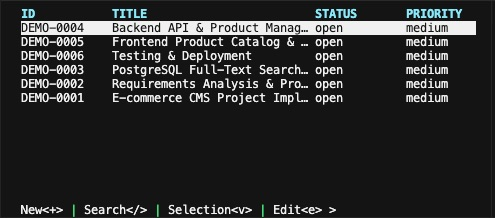
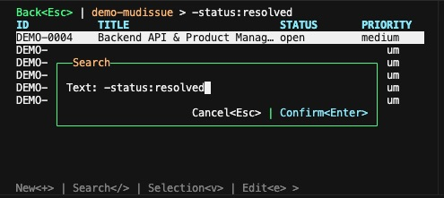
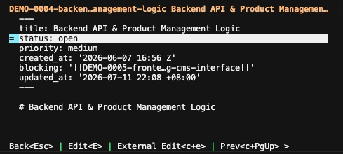
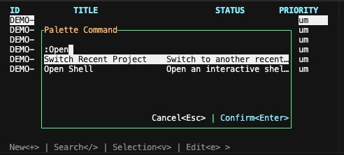

MudIssue (乜野事 in Cantonese) is a personal command-line issue tracker designed to capture tasks and integrated with your workflow. 

## Motivation

- **Note Taking Everywhere:** When working within an IDE or terminal, new ideas, tasks, or improvements often arise. A command-line tracker allows these to be captured immediately without switching to a separate note-taking application.
- **Mobile Synchronization:** By setting the issue repository in a folder accessible by tools like Obsidian, issue notes can be synced to mobile devices for review at any time.
- **AI and Workflow Integration:** Using Markdown allows for collaboration with AI to improve content or execute tasks directly, supporting workflows like SDD (Spec Driven Development).



## Features

- **Command-Line Interface:** Create, search, and edit issues directly from the terminal.
- **Markdown Storage:** Issues are stored in Markdown format for high compatibility.
- **Customizable tracker path:** Users can define custom tracker locations, such as within a folder inside Obsidian vault
- **Text User Interface**: A quick and effective way to manage your issue inside terminal.
- **Git Worktree Support:** Share the issue tracker across multiple `git worktree` instances.
- **Workspace Management:** Combine multiple issue repositories into a single master workspace.
- **Machine-Readable Output:** Includes a `--json` option to provide precise, parsable data for AI agent processing.


# Installation

```
npm install -g mudissue
```

That will install a `mud` command for manipulating the issue repository.

## Shell Completion

See [Shell Completion](docs/user/shell-completion.md) for instructions on enabling tab completion.

# Initialization

```bash
mud init
```

Initialize the issue repository by creating a mudissue config file (`mud.conf`). Run this from the root of your project (or the directory you want to track issues in).

This creates `mud.conf` in the current directory. The config defines where issues are stored and optional settings like `issue_prefix`.

To keep `mud.conf` out of version control without changing `.gitignore`, add it to Git’s local exclude list:

```bash
echo mud.conf >> .git/info/exclude
```

**Using `init --inside-git`**

If you prefer not to add a `mud.conf` file to your project root (for example, to avoid committing it to version control), you can store the configuration inside the git metadata directory instead:

```bash
mud init --inside-git
```

This creates `.git/mudissue/mud.conf`, which is located in a directory not typically tracked by VCS and avoids the need to modify your `.gitignore`.

# Configuration

After initialization, configure `mud.conf` with properties that fit your project:

```bash
mud config set-property issue_prefix "YOUR_ISSUE_PREFIX"
```

Newly created issues use this prefix. For example, if `issue_prefix` is `MZ`, issues are labeled `MZ0001`, `MZ0002`, and so on.

```bash
mud config set-property tracker_path "YOUR_TRACKER_PATH"
```

Set the tracker path that holds the `issues` folder. By default it is `.`, so issues are stored in `./issues`. Change it when you want issues elsewhere (for example, an Obsidian vault path).

## Working from Any Subdirectory including worktree

Once you have initialized (either `mud.conf` or `.git/mudissue/mud.conf`), you can run `mud` from any subdirectory of the project or from a git worktree. mudissue walks up from the current directory to find the config, so you always work against the same repo no matter where you invoke the command.

# **Text User Interface**

MudIssue provides an interactive TUI for efficient issue management, allowing you to quickly navigate between your issue table and detailed viewer without leaving the terminal.

### **Entering the TUI**

To launch the TUI environment, run:

```bash
mud view
```


### **Core Operations**

These single-key shortcuts allow you to navigate and manipulate issues instantly:

* **Search Issues**: Press / to filter your issue list in real-time.  
* **Create Issue**: Press \+ to open the creation dialog. Enter the title and press Ctrl+D (Confirm) to save.



### **Markdown Viewer**

* **Edit Issue**: Press e to open the selected issue in your default text editor.  
* **Quick Update**: When highlighted, press \= to quickly change status or priority for selected issues.



### **The Command Palette**

Press : to trigger the **Command Palette**. This opens an exhaustive list of available advanced actions and commands for managing your tracker and issues. See [Palette Commands](./docs/palette-commands.md) for the full list and descriptions.



### **Managing Relationships**

Complex issue relationships are managed through bidirectional linkages stored in frontmatter, accessed directly via the [Command Palette](./docs/palette-commands.md) (`:`):

* **Linking/Blocking**:  
  1. Select one or more issues -> press : to open the Command Palette ->select Link Issue.  
  2. Choose the link type (e.g., blocking, related).  
  3. Select the target issue from the search dialog.  
* **Sub-issues**:  
  1. Select a parent issue -> press : to open the Command Palette ->select Create Sub-issue.  
  2. Enter the child issue details to create it automatically linked to the parent.


## Advanced Topics

For a comprehensive guide on using MudIssue, please refer to the [User Guides](./docs/user/).

- [Tracker Configuration](./docs/user/configuration.md) - Configure your tracker, status catalogs, and folder patterns.
- [Property Management](./docs/user/properties.md) - Use the CLI to update YAML metadata as a database.
- [Distributed Environments](./docs/user/distributed.md) - Strategies for synchronization and managing ID uniqueness across devices.
