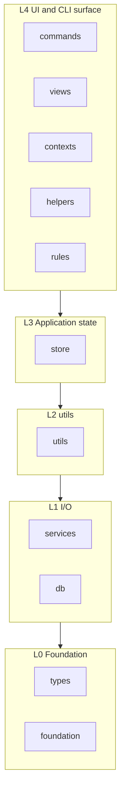

# Module layers

mudissue organizes `src/` into dependency layers. A module may import from the same layer or any lower layer, but never from a higher one. ESLint enforces import direction via `import/no-restricted-paths`, filename conventions via `mudissue/filename-convention`, and the frozen `src/` directory tree via `mudissue/no-new-src-directory` in `eslint.config.mjs` (rules live in `src/dev-tools/eslint-plugin-mudissue/`).

## Why layers

- Keep I/O, domain logic, state, orchestration, and UI separate
- Avoid import cycles and make testing easier
- Make it obvious where new code belongs

## Layer overview

Bottom → top (higher may import lower; never the reverse):

| Layer | Path | Role | May import from |
| ----- | ---- | ---- | --------------- |
| L0 | `src/types/`, `src/foundation/` | Types, formatting, parsing, layout | L0 only (plus `src/constants.ts`) |
| L1 | `src/services/`, `src/db/` | I/O wrappers | L0 |
| L2 | `src/utils/` (`storage/`, `resources/`, `validators/`, `search/`, `travelers/`, `launchers/`, `generators/`) | Repo/issue file layout, document creation, async validation, search, registry URL traversal, editor/tmux launch, mermaid graph generation | L0, L1, other L2 |
| L3 | `src/store/` | Zustand application and feature state (including `AppStore`) | L0–L2 |
| L4 | `src/commands/`, `src/views/`, `src/contexts/`, `src/helpers/`, `src/rules/` | CLI handlers, Ink TUI, React context, cross-cutting helpers, domain reaction rules | L0–L3 |

**Composition roots** (not a layer): `src/index.ts`, `src/App.tsx` may import any layer. Other modules may import `src/constants.ts` and `src/intl.ts` freely.

## Layer details

### L0 — Foundation

- **types** — shared interfaces and accessors
- **foundation** — pure helpers with no I/O: `formatter/` (dates, filenames, branches), `parser/` (e.g. `MarkdownParser`), `layouter/` (terminal table layout); may import `types`

L0 modules must not import `services`, `utils`, or anything above.

### L1 — I/O wrappers

- **services** — stateless singletons: `FileService`, `ShellService`, `GitService`, etc.
- **db** — SQLite access via `DatabaseService`

### L2 — utils

- **utils/storage** — filesystem layout for repos, issues, config files, and tracker repo discovery (`TrackerRepoStorage.find`, `findSubTrackerRepos`)
- **utils/resources** — document and issue file creation (`IssueResource`)
- **utils/validators** — async checks (e.g. git folder, tracker repo, issue folder)
- **utils/search** — issue search over storage
- **utils/travelers** — registry URL/path abstractions (`TravelerFactory`, `FileUrlTraveler`)
- **utils/launchers** — editor and tmux launch (`EditorLauncher`, `TmuxLauncher`)
- **utils/generators** — mermaid git graph output (`MermaidGitGraphGenerator`), resource templates (`TemplateGenerator`)

### L3 — Store

Zustand stores hold application state (`useAppStore`, `IssueSearchStoreFactory`, etc.). They may use resources and storage but must **not** import L4 (`commands`, `views`, `contexts`, `helpers`). UI orchestration (e.g. `editFile` with dialogs) belongs in L4 `contexts` or `views`.

### L4 — Commands, views, contexts, helpers, and rules

- **commands** — one class per CLI command (`Command` base); optional `commands/helpers/` and `commands/hooks/` for shared CLI code
- **views** — Ink components and `views/hooks/` (e.g. `useTerminal`, `useRecentFilters`)
- **contexts** — React context for the TUI (e.g. `AppContext` with `useEditFile`)
- **helpers** — shared orchestration that needs store access (e.g. `CurrentIssueResolverHelper.findCurrentIssue` in `src/helpers/`)
- **rules** — post-hook reactions to issue metadata changes (e.g. blocked/duplicated status). Registered from the composition root (`src/index.ts`); lower layers must not import `src/rules/`.

Lower layers must not depend on L4. Modules within L4 may import each other (e.g. a command calling a top-level helper).

## Filename conventions

Class files use **CamelCase** basenames. ESLint checks the basename against the directory (longest matching path wins). Violations report: *Filename does not match project conventions. See `docs/dev/module-layers.md`.*

| Directory | Pattern | Exceptions |
| --------- | ------- | ---------- |
| `src/` (root files only) | `index.ts`, `App.tsx`, `constants.ts`, `intl.ts` | — |
| `src/commands/` | `*Command.ts`, `*Command.tsx` | `Command.ts`, `index.ts` |
| `src/services/` | `*Service.ts` | — |
| `src/store/` | `*Store.ts` | — |
| `src/helpers/` | `*Helper.ts` | — |
| `src/rules/` | `*Rule.ts` | — |
| `src/contexts/` | `*Context.tsx` | — |
| `src/db/` | `DatabaseService.ts`, `KyselySqlite.ts`, `types.ts` | — |
| `src/db/migrations/` | `YYMMDD_NNN_*.ts` | `index.ts`, `types.ts` |
| `src/types/` | PascalCase or lowercase `*.ts` | `modules.d.ts` |
| `src/foundation/formatter/` | `*Formatter.ts` | — |
| `src/foundation/layouter/` | `*Layouter.ts` | — |
| `src/foundation/matchers/` | `*Matcher.ts` | — |
| `src/foundation/parser/` | `*Parser.ts` | — |
| `src/utils/` (root, no files) | — | use subdirectories below |
| `src/utils/storage/` | `*Storage.ts` | — |
| `src/utils/resources/` | `Resource.ts`, `IssueResource.ts`, `index.ts` | — |
| `src/utils/validators/` | `*Validator.ts` | — |
| `src/utils/search/` | fixed names | `IssueSearcher.ts`, `SearchQueryParser.ts`, `types.ts` |
| `src/utils/travelers/` | `*Traveler.ts` | `Traveler.ts`, `TravelerFactory.ts` |
| `src/utils/launchers/` | `*Launcher.ts` | — |
| `src/utils/generators/` | `*Generator.ts` | — |
| `src/views/hooks/` | `use*.ts` | — |
| `src/views/PaletteCommands/` | `*PaletteCommand.ts` | `PaletteCommandRegistry.ts` |
| `src/views/components/` | `*Dialog.tsx`, `*View.tsx`, plus named components | `IssueTable`, `IssueViewer`, `MarkdownViewer`, `ToolBar`, `Toast`, `EmptyArea`, `InlineIssuePicker`, `InlineConfirmation`, `InteractiveTextInput` |

## Source directory layout

The set of directories under `src/` is frozen in the `allowedSrcDirectories` set in `src/dev-tools/eslint-plugin-mudissue/no-new-src-directory.mjs`. The `mudissue/no-new-src-directory` rule walks the full `src/` tree once per ESLint run, so new folders are reported even when they contain no `.ts`/`.tsx` files. To add a directory, get human approval with an explanation, then update that allowlist and this document.

`src/dev-tools/` holds development-only tooling (e.g. the local ESLint plugin). It is excluded from `mudissue/filename-convention` and is not part of the layer import matrix.

## Conventions

- **Headless commands** should not use `useAppStore` / `AppStore`; that store is for the interactive TUI. **Exception:** commands that launch the TUI (`view`, `issue view`) may use `AppStore` when preparing interactive state.
- **Store** must not import Ink UI (`views`) or yargs handlers (`commands`).
- When parsing config or registry JSON, prefer Zod schemas and `safeParse` over ad-hoc checks.

## Testing by layer

Test files mirror `src/` under `tests/`, with one test file per production module (see `.claude/skills/unittests/SKILL.md`). Layer-specific rules:

| Layer | Test under `tests/`? | How to cover behavior |
| ----- | -------------------- | --------------------- |
| L0 (`types/`, `foundation/`) | Yes | Direct unit tests |
| L1 (`services/`, `db/`) | **No** | Do not add `tests/services/*Service.test.ts`. Services are thin I/O wrappers; test callers (L2–L4) and stub services with `Service.setInstance(mock)` or `jest.spyOn` at the call site. |
| L2 (`utils/`) | Yes | Direct unit tests; mock L1 via `Service.setInstance` |
| L3 (`store/`) | Yes | Direct unit tests |
| L4 (`commands/`, `views/`, …) | Yes | Direct unit tests; mock L1 services, not raw `fs` or external libraries |

Example: `MermaidService` optional-dependency errors are asserted in `tests/commands/IssueWorktreeCreateGraphCommand.test.ts` by stubbing `MermaidService.writeMermaidToPng`, not in a dedicated service test.

See also [AGENTS.md](../../AGENTS.md) for project-wide architecture notes.

## Examples

**Allowed**

- `EditorLauncher` (L2) → `ShellService`, `types`
- `CurrentIssueResolverHelper.findCurrentIssue` (L4) → `useCurrentTrackerRepoStore`, `GitService`
- `ViewCommand` (L4) → `CurrentIssueResolverHelper.findCurrentIssue`, `useAppStore`
- `IssueWorktreeCreateGraphCommand` (L4) → `generateMermaidGitGraph`, `useCurrentTrackerRepoStore`
- `IssueFolderStorage` (L2) → `FileService`, `foundation/formatter/DateFormatter`

**Not allowed**

- `types` → `services`
- `store` (L3) → `views` (move UI orchestration to L4 `contexts` / `views`)
- `services` → `utils/storage` (keep git path parsing in `GitService`, not `storage`)

## Known violations (follow-up)

These existing imports fail `npm run lint` until refactored:

| File | Import | Fix direction |
| ---- | ------ | ------------- |
| `src/utils/resources/IssueResource.ts` | `store/*` | Inject config / `findIssuePath` from callers |
