# Store and service class diagram

Zustand stores live in `src/store/` (L3). Stateless I/O singletons live in `src/services/` (L1). Stores may call services and other stores via `getState()`; services must not import stores.

See [module-layers.md](./module-layers.md) for the full layer rules.

## Class diagram

```mermaid
classDiagram
    direction TB

    %% ── L1 Services ──────────────────────────────────────────────
    class FileService {
        <<singleton>>
        +getInstance() FileService
        +exists(path) Promise~bool~
        +readFile(path) Promise
        +writeFile(path, data) Promise
        +readdir(path) Promise
        +mkdir(path) Promise
        +appendFile(path, data) Promise
    }

    class ShellService {
        <<singleton>>
        +getInstance() ShellService
        +cwd() string
        +which(name) Promise
        +run(command, args) void
        +open(path) Promise
    }

    class GitService {
        <<singleton>>
        +getInstance() GitService
        +parseDotGitFileAtFolder(dir) Promise
        +createGraph(worktreeDir) Promise
        +logCommits(gitFolder, ref) Promise
        +listWorktree(gitFolder) Promise
    }

    class RegistryService {
        <<singleton>>
        +getInstance() RegistryService
        +getIssueListSortOrder(projectPath) Promise
        +getPinnedIssueFolderNames(projectPath) Promise
        +upsertRecentProjects(item) Promise
        +getRecentProjects() Promise
    }

    class LoggerService {
        <<singleton>>
        +getInstance() LoggerService
        +info(args) void
        +warn(args) void
        +error(args) void
        +debug(args) void
    }

    class SilentLogger {
        +info() void
        +warn() void
        +error() void
        +debug() void
    }

    class DebugLoggerService {
        +setOutputFile(path) void
        +setOutputFileEnabled(enabled) void
        +setOutputConsoleEnabled(enabled) void
    }

    class ClipboardService {
        <<singleton>>
        +getInstance() ClipboardService
        +writeText(text) Promise
    }

    class MermaidService {
        <<singleton>>
        +getInstance() MermaidService
        +renderMermaidToSvg(definition) Promise
        +writeMermaidToPng(definition, outPath) Promise
    }

    LoggerService <|-- SilentLogger
    LoggerService <|-- DebugLoggerService
    GitService ..> FileService : reads via
    RegistryService ..> FileService : reads/writes via
    DebugLoggerService ..> FileService : appends via
    DebugLoggerService ..> ShellService : cwd via

    %% ── L3 Core stores ───────────────────────────────────────────
    class GlobalConfigStore {
        <<zustand>>
        +useGlobalConfigStore
        GlobalConfig globalConfig
        +ensureGlobalConfig() Promise~GlobalConfig~
    }

    class CurrentTrackerRepoStore {
        <<zustand>>
        +useCurrentTrackerRepoStore
        TrackerRepo currentTrackerRepo
        TrackerRepo[] subTrackerRepoList
        +ensureCurrentTrackerRepoFound() Promise
        +getCurrentTrackerRepo() Promise
        +getTrackerRepoList() Promise
        +listIssues() Promise
        +findIssue(selector) Promise
        +findIssuePath(issueId) Promise
        +getEditor(config) Promise
        +getStatusList(repo) Promise
        +getPriorityTable(repo) Promise
    }

    class IssueSearchStore {
        <<zustand factory>>
        +IssueSearchStoreFactory.createOrGet(key)
        IssueFolder[] savedSearchResults
        +searchFolders(issues, terms) Promise
        +searchAllFolders(filter) Promise
    }

    class LifeCycleStore {
        <<zustand>>
        +useLifeCycleStore
        Set mountedIds
        +mount(id) void
        +unmount(id) void
        +waitUntilMounted(id) Promise
        +waitUnitUnmounted(id) Promise
    }

    class AppStore {
        <<zustand>>
        +useAppStore
        IssueFolder[] mainIssueLists
        Page[] pageStack
        string selectedFolderName
        +mount() Promise
        +unmount() Promise
        +refreshIssueLists() Promise
        +searchIssues(filter) Promise
        +createIssue(title) Promise
        +openIssue(issue) void
        +getSelectedIssues() IssueFolder[]
        +getCurrentPage() Page
    }

    GlobalConfigStore <.. CurrentTrackerRepoStore : getState()
    GlobalConfigStore <.. IssueSearchStore : getState()
    GlobalConfigStore <.. AppStore : getState()
    CurrentTrackerRepoStore <.. IssueSearchStore : getState()
    CurrentTrackerRepoStore <.. AppStore : getState()
    IssueSearchStore <.. AppStore : getState()
    LifeCycleStore <.. AppStore : getState()

    CurrentTrackerRepoStore ..> ShellService : getInstance()
    CurrentTrackerRepoStore ..> RegistryService : getInstance()
    IssueSearchStore ..> RegistryService : getInstance()
    AppStore ..> FileService : getInstance()
    AppStore ..> ShellService : getInstance()
    AppStore ..> RegistryService : getInstance()

    %% ── L3 Popup stack ───────────────────────────────────────────
    class PopupStore {
        <<zustand>>
        +usePopupStore
        PopupNames[] popupStack
        bool hasPopup
        PopupNames latestPopup
        +pushPopup(name) void
        +popPopup() void
    }

    class PopupNames {
        <<enumeration>>
        AlertDialog
        ConfirmationDialog
        CreateIssueDialog
        CreateIssueFromFileDialog
        SearchingDialog
        Toast
        PaletteCommand
    }

    PopupStore ..> PopupNames : tracks

    class AlertDialogStore {
        <<zustand>>
        +useAlertDialogStore
        bool isDialogOpen
        string message
        +open(message) Promise
        +close() void
    }

    class ConfirmationDialogStore {
        <<zustand>>
        +useConfirmationDialogStore
        bool isDialogOpen
        string title
        string message
        +open(options) Promise
        +confirm() void
        +close() void
    }

    class CreateIssueDialogStore {
        <<zustand>>
        +useCreateIssueDialogStore
        bool isDialogOpen
        IssueFolder parentIssue
        +open(parent) void
        +close() void
    }

    class CreateIssueFromFileDialogStore {
        <<zustand>>
        +useCreateIssueFromFileDialogStore
        bool isDialogOpen
        +open() Promise
        +confirm() void
        +close() void
    }

    class SearchingDialogStore {
        <<zustand factory>>
        +createSearchingDialogStore()
        bool isDialogOpen
        string value
        +open(options) Promise
        +confirm() void
        +close() void
    }

    class ToastStore {
        <<zustand>>
        +useToastStore
        bool isToastOpen
        string message
        ToastVariant variant
        +info(message) Promise
        +error(message) Promise
        +close() void
    }

    class PaletteCommandStore {
        <<zustand>>
        +usePaletteCommandStore
        bool isOpen
        PaletteCommand[] commands
        ToolbarConfigItem[] toolbarItems
        string initialFilterQuery
        +open(options) void
        +close() void
    }

    AlertDialogStore ..> PopupStore : push/pop
    ConfirmationDialogStore ..> PopupStore : push/pop
    CreateIssueDialogStore ..> PopupStore : push/pop
    CreateIssueFromFileDialogStore ..> PopupStore : push/pop
    SearchingDialogStore ..> PopupStore : push/pop
    ToastStore ..> PopupStore : push/pop
    PaletteCommandStore ..> PopupStore : push/pop
    AppStore ..> ToastStore : getState()
```

## Store inventory

| Store | Hook / factory | Role |
| ----- | -------------- | ---- |
| `AppStore` | `useAppStore` | TUI application state: issue table, viewer navigation, search, create issue |
| `CurrentTrackerRepoStore` | `useCurrentTrackerRepoStore` | Active tracker repo, sub-repos, issue lookup, editor/worktree paths |
| `GlobalConfigStore` | `useGlobalConfigStore` | Cached global config from `~/.config/mudissue/` |
| `IssueSearchStore` | `IssueSearchStoreFactory.createOrGet(key)` | Keyed cross-repo issue search (`IssueTable`, `Headless`) |
| `LifeCycleStore` | `useLifeCycleStore` | Component mount/unmount coordination for async TUI flows |
| `PopupStore` | `usePopupStore` | Shared popup stack (`PopupNames`) for overlay focus |
| `AlertDialogStore` | `useAlertDialogStore` | Blocking alert dialog |
| `ConfirmationDialogStore` | `useConfirmationDialogStore` | Accept / cancel confirmation dialog |
| `CreateIssueDialogStore` | `useCreateIssueDialogStore` | New-issue title input dialog |
| `CreateIssueFromFileDialogStore` | `useCreateIssueFromFileDialogStore` | Create issue from file confirmation |
| `SearchingDialogStore` | `createSearchingDialogStore()` | Per-instance search filter dialog (vanilla Zustand) |
| `ToastStore` | `useToastStore` | Transient info/error toasts |
| `PaletteCommandStore` | `usePaletteCommandStore` | Command palette overlay (commands, toolbar help, issue search) |

## Service inventory

| Service | Used by stores | Role |
| ------- | -------------- | ---- |
| `FileService` | `AppStore` | Filesystem I/O abstraction |
| `ShellService` | `AppStore`, `CurrentTrackerRepoStore` | `cwd`, `which`, subprocess, open |
| `RegistryService` | `AppStore`, `CurrentTrackerRepoStore`, `IssueSearchStore` | SQLite registry: sort order, pins, recent projects |
| `GitService` | — | Read-only git metadata (commands/async, not stores) |
| `LoggerService` | — | Console logging (`SilentLogger`, `DebugLoggerService` variants) |
| `ClipboardService` | — | System clipboard (views/commands) |
| `MermaidService` | — | Mermaid → SVG/PNG rendering (commands) |

Only three services are referenced directly from store modules today. The others are consumed by commands, views, and async at L4/L2.

## Test reset helpers

Several stores export `reset*Store()` for Jest isolation:

- `resetAppStore`
- `resetCurrentTrackerRepoStore`
- `resetGlobalConfigStore`
- `resetIssueSearchStore`
- `resetLifeCycleStore`

Dialog and popup stores are typically reset implicitly when tests tear down the TUI or by re-creating `SearchingDialogStore` instances.
